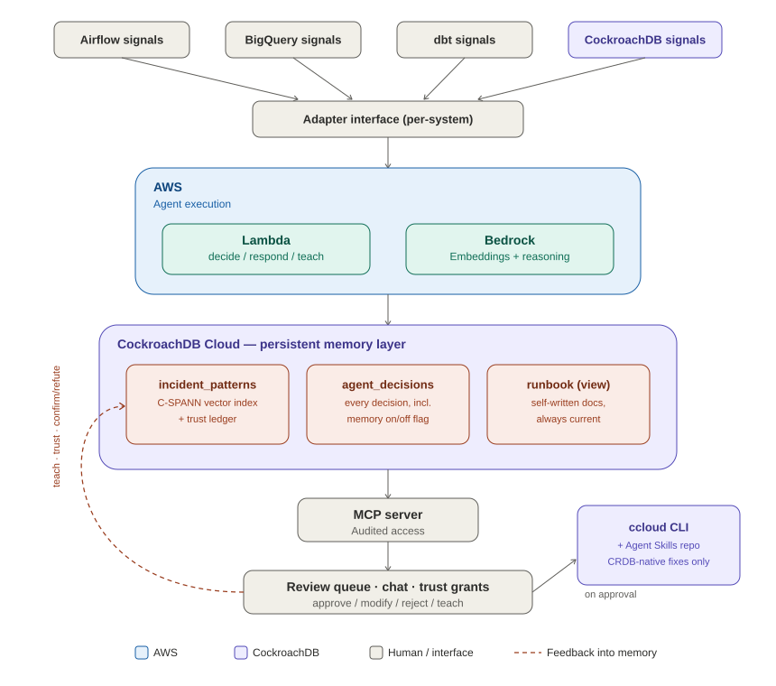

# incident-memory-agent

*Mimir — consult what survived.*

Built for the **CockroachDB × AWS Hackathon** ("Build with Agentic
Memory"). An incident triage agent for data platforms — Airflow,
BigQuery, dbt, and CockroachDB itself — whose memory of every past
incident, and of how much the human trusts its judgment, persists in
CockroachDB. A lesson taught once, anywhere, is instantly reusable
everywhere, and survives any failure — including the incident itself.

## What makes it different

- **Trust ledger** — the agent remembers not just incidents but the
  outcomes of its own judgment. Approvals earn autonomy per pattern;
  a single rejection revokes it. The human-in-the-loop gate is
  learned, earned, and revocable — not hardcoded.
- **Memoryless counterfactual** — flip memory off and watch the same
  incident stream flood the review queue; flip it on and watch it
  melt. On-call life, before and after.
- **Cross-system pattern pollination** — a failure class taught from
  one Airflow incident matches its BigQuery and dbt cousins. One
  lesson, three systems.
- **Self-writing runbook** — team documentation as a queryable view
  over the agent's memory, always current, never manually edited.

## Tools used

- **CockroachDB:** Distributed Vector Indexing (C-SPANN) + MCP Server
  (core memory + analyst interface, every incident); ccloud CLI +
  Agent Skills Repo (CockroachDB-native incident remediation — the
  agent uses CockroachDB's own published expertise to keep its own
  memory layer healthy)
- **AWS:** Bedrock (embeddings + reasoning), Lambda (decision step)

## Docs

- `docs/DESIGN.md` — full rationale
- `docs/DEMO_SCRIPT.md` — 3-minute video storyboard
- `docs/HANDOVER.md` — build order + submission checklist

## Status

Scaffolded (schema + docs). Incidents in the demo are simulated with
authentic payload shapes — declared plainly, by design.

## License

MIT — see `LICENSE`.
