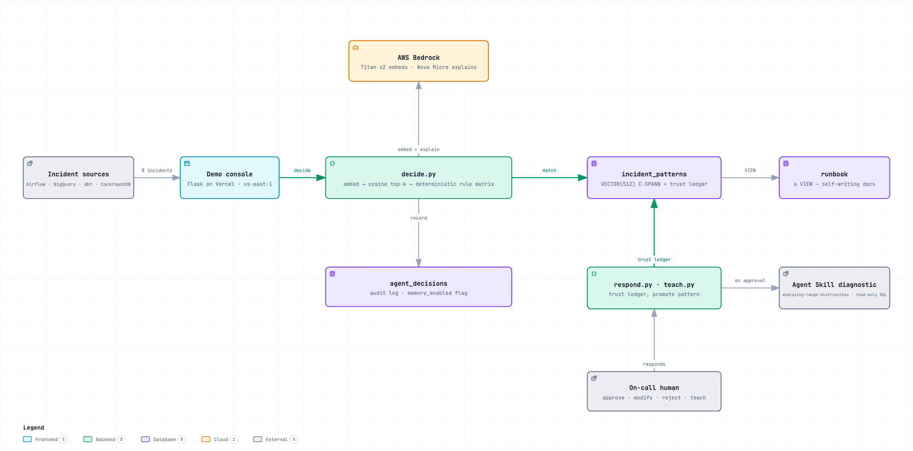

# incident-memory-agent

*Mimir — consult what survived.*

Built for the **CockroachDB × AWS Hackathon** ("Build with Agentic Memory"). An
incident-triage agent for data platforms — Airflow, BigQuery, dbt, and
CockroachDB itself — whose memory of every past incident, **and** of how much
the human trusts its judgment, persists in CockroachDB. A lesson taught once,
anywhere, is instantly reusable everywhere, and survives any failure — including
the incident itself.



*Interactive versions: [architecture](docs/diagrams/architecture.html) · [one incident end to end](docs/diagrams/sequence.html) — both have guided views, hover-to-trace and export.*

> **▶ [Interactive engineering walk-through](https://pi5qzv7wstff2tdkq73odywisq0jxnwt.lambda-url.us-east-1.on.aws/tutorial)** — a live tutorial where the widgets run the real decision logic: toggle memory on/off, teach a schema-drift pattern and watch it pollinate across systems, and earn autonomy in the trust-ledger simulator.

## What makes it different

- **Trust ledger** — the agent remembers not just incidents but the outcomes of
  its own judgment, per pattern. Unchanged approvals earn autonomy; a single
  rejection revokes it. The human-in-the-loop gate is **learned, earned, and
  revocable** — not hardcoded.
- **Memoryless counterfactual** — flip one boolean (`memory_enabled`) and the
  same incident stream floods the review queue; flip it back and the queue
  melts. On-call life, before and after memory — no infrastructure kill needed.
- **Cross-system pattern pollination** — a `failure_class` taught from one
  Airflow incident matches its BigQuery and dbt cousins in embedding space. One
  lesson, three systems.
- **Self-writing runbook** — team documentation as a queryable VIEW over the
  agent's memory, always current, never hand-edited.

## How it works (30 seconds)

An incident fires → `embed.py` turns it into a normalized signature and a Bedrock
Titan vector → `decide.py` finds the nearest known pattern by cosine distance in
CockroachDB and picks **one** action with a deterministic rule matrix
(auto-resolve / propose / escalate) → the human responds → `respond.py` updates
the trust ledger → a never-seen incident is escalated and `teach.py` promotes the
human's diagnosis into a new pattern that its cross-system cousins then match.

See **[docs/ARCHITECTURE.md](docs/ARCHITECTURE.md)** for the full shape and
**[docs/LEARNING.md](docs/LEARNING.md)** for the tech breakdown with primary
sources.

## Where this runs

Stated plainly so nothing has to be inferred:

| Piece | Where it runs |
|---|---|
| **Persistent memory layer** — vectors, trust ledger, audit log | **CockroachDB Cloud on AWS**, `us-east-1` |
| **Embeddings + reasoning prose** — every decision | **Amazon Bedrock**, `us-east-1` (Titan Text v2, Nova Micro) |
| **Decision engine** (`decide.py`) | `handler(event, context)` — **AWS Lambda-shaped**, deploys there unchanged |
| **Web console** | **AWS Lambda** (container image, arm64) behind a Function URL, `us-east-1` |

Every part of this runs on AWS, in one region. The console is a Lambda container image
behind a Function URL, using the
[AWS Lambda Web Adapter](https://github.com/awslabs/aws-lambda-web-adapter) so `app.py`
stays an ordinary Flask/WSGI app with no Lambda-specific branch.

The Lambda stores **no long-lived credential**: Bedrock access comes from its execution
role, scoped to exactly `amazon.titan-embed-text-v2:0` and `amazon.nova-micro-v1:0`. What
the process actually uses is a short-lived STS credential that Lambda injects and rotates,
never an IAM user key stored in the environment.

Nothing in the code is host-specific — the adapter means `app.py` is an ordinary WSGI app
— and co-location matters more than the host does: running in the cluster's region took 8
concurrent decisions from 13.5s to 1.5s.

## Why CockroachDB, and not Postgres with pgvector

For the vector search alone, Postgres is a real option — no point pretending otherwise.
Two things make the difference here:

1. **The memory is needed exactly when infrastructure is misbehaving.** That's not an
   edge case for an incident agent, it's the only case. A single-node memory's failure
   mode is perfectly correlated with the moment of maximum need.
2. **The trust ledger must be transactional with the vector it describes.** Autonomy is
   granted only when a pattern's approval streak justifies it, so the check on
   `approved_unchanged_count` and the vector that found the pattern have to be one
   consistent snapshot. Split across a vector DB and an operational DB, there's a window
   where the agent can be granted authority it never earned — a safety hole, not a
   perf regression. One row, one serializable transaction, and it can't exist.

That second point is also why a purpose-built memory service wasn't the answer: those
model recall, not authority, and this project's differentiator lives in the join between
the two.

## Tools used, and how

- **CockroachDB — Distributed Vector Indexing (C-SPANN):** incident patterns are
  stored as `VECTOR(512)` and matched with the cosine `<=>` operator
  (`vector_cosine_ops`). This is the core memory, and it *is* on every incident's
  decision path.
- **CockroachDB — MCP Server: not used.** The cluster exposes a managed MCP endpoint
  and it would have been a convenient development-side way to inspect schema, but it
  was never wired up. The runtime talks pgwire directly and always did. Listed here
  because a reader comparing this repo against the tool list deserves to know which
  boxes we are *not* ticking.
- **CockroachDB — Agent Skills:** *only* for the CockroachDB-native incident. A matched
  hot-range pattern carries `skill_ref='analyzing-range-distribution'` and proposes the
  real [skill](https://github.com/cockroachlabs/cockroachdb-skills) from Cockroach Labs;
  on approval its read-only diagnostic runs against the live cluster and returns real
  range ids. This does not diagnose Airflow/BigQuery/dbt — the split is deliberate.
- **CockroachDB — ccloud CLI: a code path we never executed.** `ccloud_wrapper.py` has a
  working `--via ccloud` branch, but `ccloud auth login` is interactive-browser and
  cannot run in a serverless function, so the deployed demo defaults to `via="sql"` and
  runs the identical read-only SQL over pgwire. Not claimed as a tool used.
- **AWS Bedrock:** Titan Text Embeddings v2 (`amazon.titan-embed-text-v2:0`, 512
  dims) for embeddings; the Converse API (default Nova Micro) for the reasoning
  prose on a match. The *decision* is deterministic; the LLM only explains.
- **AWS Lambda:** a supported target, not a claim. `decide.py` exposes
  `handler(event, context)` and deploys to Lambda unchanged, but the live demo runs it
  on **AWS Lambda** in us-east-1, co-located with the cluster. Bedrock and Lambda are both
  in the request path; ECR holds the image and IAM issues the function's Bedrock
  credential per invocation.

## Repo layout

```
scripts/
  simulate_incidents.py   incident cast -> monitored_signals (authentic payloads)
  embed.py                signature -> Titan embedding (shared by seed + live)
  seed_patterns.py        seed the 4 pre-loaded patterns + trust preload
  decide.py               embed -> cosine top-k -> deterministic action -> agent_decisions
  respond.py              trust ledger: approve/modify/reject, earned autonomy, revoke
  teach.py                escalation -> promoted pattern (closes teach->pollinate loop)
schema/schema.sql         monitored_signals, incident_patterns (trust ledger), agent_decisions, runbook view
docs/                     ARCHITECTURE, LEARNING, DESIGN, DEMO_SCRIPT, HANDOVER, adr/
```

## Quickstart

```sh
# 1. CockroachDB — Cloud Basic (free) or a local single node
cockroach start-single-node --insecure --listen-addr localhost:26257 --background
cockroach sql --insecure -e "SET CLUSTER SETTING feature.vector_index.enabled = true;"
cockroach sql --insecure < schema/schema.sql

# 2. Config
cp .env.example .env    # set COCKROACH_URL, AWS_REGION; AWS creds via your profile

# 3. Offline self-checks (no cluster / no AWS needed)
for s in simulate_incidents embed seed_patterns decide respond teach; do
  python3 scripts/$s.py --check
done

# 4. End-to-end (needs cluster + Bedrock)
python3 scripts/seed_patterns.py --seed
python3 scripts/simulate_incidents.py --inject
python3 scripts/decide.py --all --memory-off     # counterfactual: everything escalates
python3 scripts/decide.py --all                    # memory on: known incidents match
```

Dependencies: `psycopg[binary]` (v3), `boto3`.

## Reviewer access

The app is open by default. Setting `DEMO_PASSCODE` (a Lambda environment variable) gates
the six endpoints that **mutate** demo state — reset, decide, teach, respond, grant,
ccloud — while leaving everything readable. The dashboard, the incident records and the
live-SQL panel stay public; only the controls that spend model calls or change the board
require the key.

Reviewers get a link, not a form: `https://<host>/?key=<passcode>` sets a cookie once and
the clean URL works from then on. `/demo` and `/tutorial` accept the same link. Scripted
access can send `X-Demo-Passcode` instead. Comparison is constant-time and the passcode is
never rendered into the page.

This exists because demo state is **global**: the daily Bedrock caps below already handle
cost, but one stranger mid-run leaves the board looking broken for whoever opens it next.
Per-session state is the real fix and is listed under *What's next*.

```bash
# generate one without it appearing in your shell history or any log
python3 -c "import secrets; print(secrets.token_urlsafe(18))"   # add to deploy/.env.deploy, then re-run deploy/deploy.sh
```

## Status

Live: **https://pi5qzv7wstff2tdkq73odywisq0jxnwt.lambda-url.us-east-1.on.aws** — on AWS Lambda,
an operator dashboard backed by a
real CockroachDB Cloud cluster with real Bedrock embeddings and reasoning. The incident
*stream* is generated for the demo; everything downstream of it — the vector search, the
decisions, the trust ledger, the audit log — is live. Every incident exposes its
underlying `monitored_signals` row so you can check that rather than take our word.
The original guided console is still at `/demo`. Nine scripts,
each with an offline `--check`. Measured on the live cluster: escalation
**100% → 38%** with memory on, and a pattern taught from Airflow matches its
BigQuery (0.72) and dbt (0.68) cousins. See **[docs/PROGRESS.md](docs/PROGRESS.md)**.

## Docs

- [docs/ARCHITECTURE.md](docs/ARCHITECTURE.md) — current system shape
- [docs/LEARNING.md](docs/LEARNING.md) — tech breakdown + primary sources
- [docs/DESIGN.md](docs/DESIGN.md) — full rationale
- [docs/DEMO_SCRIPT.md](docs/DEMO_SCRIPT.md) — 3-minute video storyboard
- [docs/HANDOVER.md](docs/HANDOVER.md) — build order + submission checklist
- [docs/adr/](docs/adr/) — architecture decision records

## License

MIT — see `LICENSE`.
